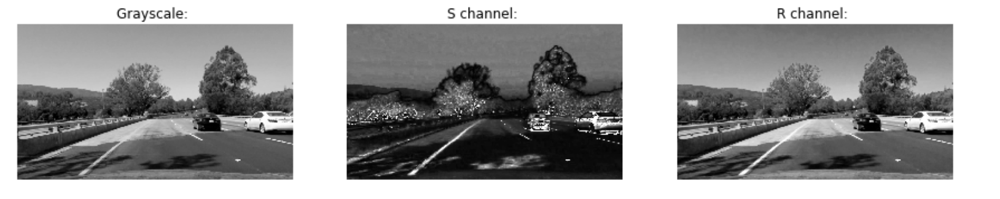
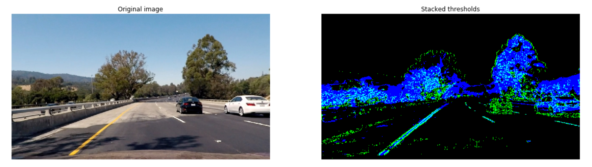
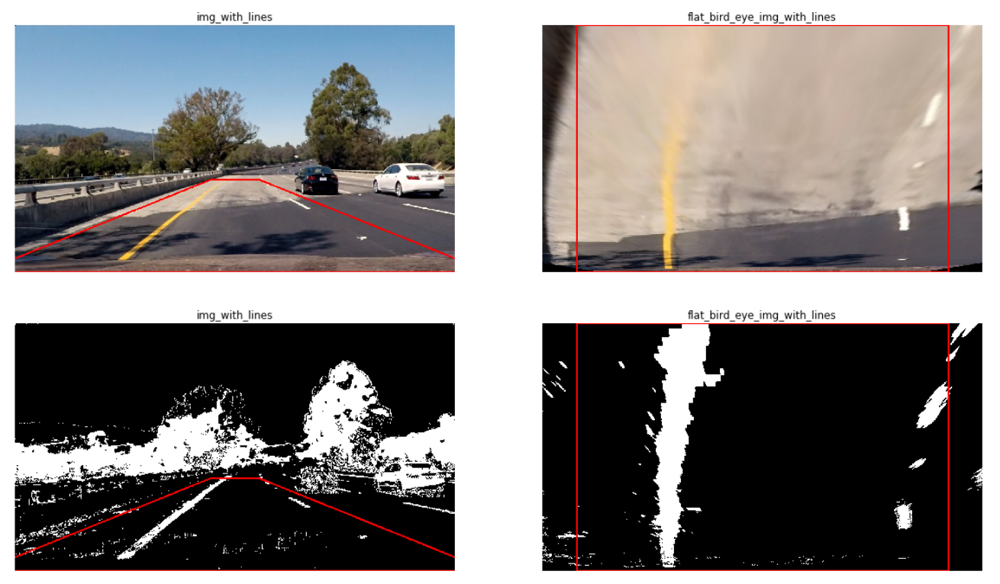

# Project Structure

|                   File                   |               Description                |
| :--------------------------------------: | :--------------------------------------: |
| `source/lanetracker/camera_calibrate.py` | Implement camera calibration based on the set of calibration patterns. |
| `source/lanetracker/gredient_thresh.py`  | Calculate gradient to detect the pixels belong to lane. |
|   `source/lanetracker/color_thresh.py`   | Apply threshold to image with either HLS colorspace or RGB colorspace to find white and yello lane pixels. |
|   `source/lanetracker/perspective.py`    | Mapping the image from the vehicle front-facing camera to a bird view |
|   `source/lanetracker/lane_finder.py`    | Use peaks in a histogram of the bottom half of the image to decide explicitly which pixels are part of the lines. |
|                                          |                                          |


# Lane Tracker

The software pipeline to identify the lane boundaries in the given video which includes the following steps applying to each frame:

* **Camera Calibration.** 
* **Gredient and Color Threshing.**
* **Perspective Transformation.**
* **Find Boundary Lane.**


## Camera Calibration

Whenever we take photos with camera, there would be distortion introduced by lenses. To calibrate such distortion. Here we need to calculate two parameters. One is **_camera matrix_**, and the other is **_distortion coefficient_**.

* **Camera Matrix** : A 3x4 matrix which describes the mapping of a camera from 3D points in the world to 2D points in an image.
* **Distortion Coefficient** : Real cameras use curved lenses to form an image, and light rays often 
  bend a little too much or too little at the edges of these lenses. This 
  creates an effect that distorts the edges of images.

To calculate the parameters, we need the set of calibration patterns which have known geometry and easily detectable feature points. And OpenCV has built-in support for a chessboard as a calibration pattern. Here we use the given chessboard images in the folder `data/camera_cal` as calibration patterns.

e.g. calibration1.jpg


First, we need to prepare object points and also initialize two lists to store objppoints and imgpoints. Pattern size (x, y) should pass only points where two black and two white squares intersects. In the picture above there are 9 each row along x-axis, 6 each column along y-axis, that is to say, pattern_size = (9, 6).

```python
    --------- x-axis ---------->
  | (0,0,0) ...          (8,0,0)
  |
y-axis
  |
  v (5,0,0) ...          (8,5,0)

# prepare object points, like (0,0,0), (1,0,0), (2,0,0), ....,(8,5,0)
# use numpy mgrid function to generate the coordinates values for a given grid size.
grid_x, grid_y = pattern_size[0], pattern_size[1]
objp = np.zeros((grid_y * grid_x, 3), np.float32)
objp[:,:2] = np.mgrid[:grid_x, :grid_y].T.reshape(-1,2)

# Arrays to store object points and image points from all the sample images.
objpoints = [] # 3d points in real world space
imgpoints = [] # 2d points in image plane.
```

Then for each calibration images, we use `cv2.findChessboardCorners` to try to find every distorted image corners on that image. `gray` is the original image with grayscale tranformation.

```pythonfound, corners = cv2.findChessboardCorners(gray, pattern_size, None)
found, corners = cv2.findChessboardCorners(gray, pattern_size, None)
```

If found, then we append the object points (always (0,0,0) … (8,5,0)) and image points (corners) into python lists `objpoints` and `imgpoints` 

Once we collected numbers of images (usually 10 is enough). We could calculate **_camera matrix_** and **_distortion coef_** accordingly.

```python
_, self.camera_matrix, self.distortion_coef, _, _ = cv2.calibrateCamera(objpoints, imgpoints, img_size, None, None)
```

e.g. calibration1.jpg after Camera Calibration (including in `output_images/undistort_images`)


> For implementation details check `CameraCalibration` class in `lanetracker/camera_calibrate.py`

## Gredient and Color Threshing

To precisely detect the lane boundary, we combine both the tech gredient threshing introduced by sobel operator which used to detect the edge of lane and color threshing with HLS and RGB colorspace which used to detect as many as pixels belongs to yellow and white lanes.

The following is the technique we could apply,

### Gradient absolute value

Calculate absolute gradient value with respect to x direction or y direction.

```python
np.absolute(cv2.Sobel(single_channel_img, cv2.CV_64F, 1, 0, ksize=sobel_kernel))
```

### Gradient magnitude

Calculate overall magnitude of the gradient, in both x and y.

```python
# Take both Sobel x and y gradients
sobelx = cv2.Sobel(single_channel_img, cv2.CV_64F, 1, 0, ksize=sobel_kernel)
sobely = cv2.Sobel(single_channel_img, cv2.CV_64F, 0, 1, ksize=sobel_kernel)
# Calculate the gredient magnitude
gradmag = np.sqrt(sobelx**2 + sobely**2)
```

### Gradient direction

The direction of the gradient is simply the inverse tangent (arctangent) of the y gradient divided by the x gradient: $arctan(sobely/sobelx)$

```python
sobelx = cv2.Sobel(single_channel_img, cv2.CV_64F, 1, 0, ksize=sobel_kernel)
sobely = cv2.Sobel(single_channel_img, cv2.CV_64F, 0, 1, ksize=sobel_kernel)
absgraddir = np.arctan2(np.absolute(sobely), np.absolute(sobelx))
```

### HLS and RGB Colorspace 

We chould choose either h, l, s channel in HLS and r, g, b channel in RGB to thresh out our result.

After testing on Grayscale, S channel and R channel, we found that S channel could make white and yellow lane more contrastive to their background. So I decide to use S channel image as the image to do gredient thresh.

**Note. **However in some situation, S channel may not be as good as Grayscale.



Finally I adopt the following combination.

```python
gredient_binary = np.zeros_like(gradx_binary)
color_binary = np.zeros_like(gradx_binary)
gredient_binary[(gradx_binary == 1) | ((mag_binary == 1) & (dir_binary == 1))] = 1
color_binary[(h_binary == 1) | (r_binary == 1)] = 1
```

| Gredient Threshing  |               Description                |
| :-----------------: | :--------------------------------------: |
|    gradx_binary     | Use S channel img to calculate gradient absolute value along x direction, with kernel size=3, thresh=(20, 150) |
|     mag_binary      | Use S channel img to calculate gradient magnitude, with kernel size=9, thresh=(50, 100) |
|     dir_binary      | Use S channel img to calculate gradient direction, kernel size=15, thresh=(0.7, 1.3) |
|                     |                                          |
| **Color Threshing** |             **Description**              |
|      r_binary       | R channel from RGB colorspace, with thresh=(220, 255), contributes to both white and yellow lane. |
|      h_binary       | H channel from HLS colorspace, with thresh=(19, 70), contributes mainly to yellow lane. |

Output: Green for gradient threshing, Blue for color threshing.



> For implementation details check functions in `lanetracker/gredient_thresh.py` and `lanetracker/color_thresh.py`

## Perspective Transformation

The method to define src and dst vertices refers to [Navoshta's repo](https://github.com/navoshta/detecting-road-features/blob/master/README.md#perspective-tranform).

Originally, I use the src vertices which exactly form the trapezoid, like what the courses provide.

e.g.


**However, with this way, we can never generalize method on to real world. **

We need more rebust method which cover most of views recevied from car camera. 

Here is how we choose these src and dst vertices,

* **top_offset** used to revise the x value of src vertices with y value equal to roi_y_top. Here I set it **70**.
* **camera_offset** used to revise the midden of image view to the midden of car view. Here I set it **0**.

```python
(h, w) = (img.shape[0], img.shape[1])
roi_y_top = h*0.625
mid_x = w//2

# the reason why I seperate src_vertices with type int32 from src with type float32 is to draw the red polygon in the image.
src_vertices = np.array([[mid_x + top_offset + camera_offset, roi_y_top], [w + 100 + camera_offset, h], [-100 + camera_offset, h], [mid_x - top_offset + camera_offset, roi_y_top]], dtype=np.int32)

dst_vertices = np.array([[w - 100 + camera_offset, 0], [w - 100 + camera_offset, h], [100 + camera_offset, h], [100 + camera_offset, 0]], dtype=np.int32)

src = np.float32(src_vertices)
dst = np.float32(dst_vertices)

# perspective transform is a matrix that's returned by the function getPerspectiveTranform
M = cv2.getPerspectiveTransform(src, dst)

img_size = (img.shape[1], img.shape[0])

# Apply the transform M to the original image to get the wraped image
warped = cv2.warpPerspective(img, M, img_size, flags=cv2.INTER_LINEAR)
```

This resulted in the following source and destination points:

| Source    | Destination |
| --------- | ----------- |
| 710, 450  | 1180, 0     |
| 1380, 720 | 1180, 720   |
| -100, 720 | 100, 720    |
| 570, 450  | 100, 0      |



> For implementation details check functions in `lanetracker/perspective.py`.

## Find Boundary Lane


Creating a great writeup:
---

A great writeup should include the rubric points as well as your description of how you addressed each point.  You should include a detailed description of the code used in each step (with line-number references and code snippets where necessary), and links to other supporting documents or external references.  You should include images in your writeup to demonstrate how your code works with examples.  

All that said, please be concise!  We're not looking for you to write a book here, just a brief description of how you passed each rubric point, and references to the relevant code :). 

You're not required to use markdown for your writeup.  If you use another method please just submit a pdf of your writeup.

The Project
---

The goals / steps of this project are the following:

* Compute the camera calibration matrix and distortion coefficients given a set of chessboard images.
* Apply a distortion correction to raw images.
* Use color transforms, gradients, etc., to create a thresholded binary image.
* Apply a perspective transform to rectify binary image ("birds-eye view").
* Detect lane pixels and fit to find the lane boundary.
* Determine the curvature of the lane and vehicle position with respect to center.
* Warp the detected lane boundaries back onto the original image.
* Output visual display of the lane boundaries and numerical estimation of lane curvature and vehicle position.

The images for camera calibration are stored in the folder called `camera_cal`.  The images in `test_images` are for testing your pipeline on single frames.  If you want to extract more test images from the videos, you can simply use an image writing method like `cv2.imwrite()`, i.e., you can read the video in frame by frame as usual, and for frames you want to save for later you can write to an image file.  

To help the reviewer examine your work, please save examples of the output from each stage of your pipeline in the folder called `ouput_images`, and include a description in your writeup for the project of what each image shows.    The video called `project_video.mp4` is the video your pipeline should work well on.  

The `challenge_video.mp4` video is an extra (and optional) challenge for you if you want to test your pipeline under somewhat trickier conditions.  The `harder_challenge.mp4` video is another optional challenge and is brutal!

If you're feeling ambitious (again, totally optional though), don't stop there!  We encourage you to go out and take video of your own, calibrate your camera and show us how you would implement this project from scratch!
