# Project Structure

|                   File                   |               Description                |
| :--------------------------------------: | :--------------------------------------: |
| `source/lanetracker/camera_calibrate.py` | Implement camera calibration based on the set of calibration patterns. |
| `source/lanetracker/gredient_thresh.py`  | Calculate gradient to detect the pixels belong to lane. |
|   `source/lanetracker/color_thresh.py`   | Apply threshold to image with either HLS colorspace or RGB colorspace to find white and yello lane pixels. |
|   `source/lanetracker/perspective.py`    | Mapping the image from the vehicle front-facing camera to a bird view |
|       `source/lanetracker/line.py`       | Use peaks in a histogram of the bottom half of the image to decide explicitly which pixels are part of the lines. |
| `source/vehicletracker/subset_of_project` | contrain the practice code teached from vehicle detecting lessons. |
|          `source/example.ipynb`          | the main pipeline to execute each module (including all function used in vehicle tracking) |


# Lane Tracker

The goals / steps of this project are the following:

- Compute the camera calibration matrix and distortion coefficients given a set of chessboard images.
- Apply a distortion correction to raw images.
- Use color transforms, gradients, etc., to create a thresholded binary image.
- Apply a perspective transform to rectify binary image ("birds-eye view").
- Detect lane pixels and fit to find the lane boundary.
- Determine the curvature of the lane and vehicle position with respect to center.
- Warp the detected lane boundaries back onto the original image.
- Output visual display of the lane boundaries and numerical estimation of lane curvature and vehicle position.


The software pipeline to identify the lane boundaries in the given video which includes the following steps applying to each frame:

* **Camera Calibration.** 
* **Gredient and Color Threshing.**
* **Perspective Transformation.**
* **Find Boundary Lane.**
* **Measure Curvature of Radius and Vehicle Position**


## Camera Calibration

Whenever we take photos with camera, there would be distortion introduced by lenses. To calibrate such distortion. Here we need to calculate two parameters. One is **_camera matrix_**, and the other is **_distortion coefficient_**.

* **Camera Matrix** : A 3x4 matrix which describes the mapping of a camera from 3D points in the world to 2D points in an image.
* **Distortion Coefficient** : Real cameras use curved lenses to form an image, and light rays often 
  bend a little too much or too little at the edges of these lenses. This 
  creates an effect that distorts the edges of images.

To calculate the parameters, we need the set of calibration patterns which have known geometry and easily detectable feature points. And OpenCV has built-in support for a chessboard as a calibration pattern. Here we use the given chessboard images in the folder `data/camera_cal` as calibration patterns.


First, we need to prepare object points and also initialize two lists to store objppoints and imgpoints. Pattern size (x, y) should pass only points where two black and two white squares intersects. In the given picture, there are 9 points each row along x-axis, 6 points each column along y-axis, that is to say, pattern_size = (9, 6).

```python
    --------- x-axis ---------->
  | (0,0,0) ...          (8,0,0)
  |
y-axis
  |
  v (5,0,0) ...          (8,5,0)

# prepare object points, like (0,0,0), (1,0,0), (2,0,0), ....,(8,5,0)
# use numpy mgrid function to generate the coordinates values for a given grid size.
grid_x, grid_y = pattern_size[0], pattern_size[1]
objp = np.zeros((grid_y * grid_x, 3), np.float32)
objp[:,:2] = np.mgrid[:grid_x, :grid_y].T.reshape(-1,2)

# Arrays to store object points and image points from all the sample images.
objpoints = [] # 3d points in real world space
imgpoints = [] # 2d points in image plane.
```

Then for each calibration images, we use `cv2.findChessboardCorners` to try to find every distorted image corners on that image. `gray` is the original image with grayscale tranformation.

```pythonfound, corners = cv2.findChessboardCorners(gray, pattern_size, None)
found, corners = cv2.findChessboardCorners(gray, pattern_size, None)
```

If found, then we append the object points (always (0,0,0) … (8,5,0)) and image points (corners) into python lists `objpoints` and `imgpoints` 

Once we collected numbers of images (usually 10 is enough). We could calculate **_camera matrix_** and **_distortion coef_** accordingly.

```python
_, self.camera_matrix, self.distortion_coef, _, _ = cv2.calibrateCamera(objpoints, imgpoints, img_size, None, None)
```

e.g. calibration1.jpg after Camera Calibration (including in folder `output_images/undistort_images`)

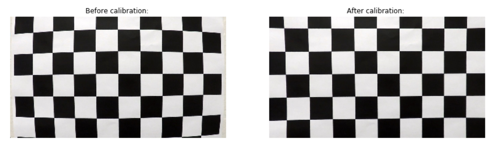

> For implementation details check `CameraCalibration` class in `lanetracker/camera_calibrate.py`

## Gredient and Color Threshing

To precisely detect the lane boundary, we combine both the tech gredient threshing introduced by sobel operator which used to detect the edge of lane and color threshing with HLS and RGB colorspace which used to detect as many as pixels belongs to yellow and white lanes.

The following is the technique we could apply,

### Gradient absolute value

Calculate absolute gradient value with respect to x direction or y direction.

```python
np.absolute(cv2.Sobel(single_channel_img, cv2.CV_64F, 1, 0, ksize=sobel_kernel))
```

### Gradient magnitude

Calculate overall magnitude of the gradient, in both x and y.

```python
# Take both Sobel x and y gradients
sobelx = cv2.Sobel(single_channel_img, cv2.CV_64F, 1, 0, ksize=sobel_kernel)
sobely = cv2.Sobel(single_channel_img, cv2.CV_64F, 0, 1, ksize=sobel_kernel)
# Calculate the gredient magnitude
gradmag = np.sqrt(sobelx**2 + sobely**2)
```

### Gradient direction

The direction of the gradient is simply the inverse tangent (arctangent) of the y gradient divided by the x gradient: $arctan(sobely/sobelx)$

```python
sobelx = cv2.Sobel(single_channel_img, cv2.CV_64F, 1, 0, ksize=sobel_kernel)
sobely = cv2.Sobel(single_channel_img, cv2.CV_64F, 0, 1, ksize=sobel_kernel)
absgraddir = np.arctan2(np.absolute(sobely), np.absolute(sobelx))
```

### HLS and RGB Colorspace 

We chould choose either h, l, s channel in HLS and r, g, b channel in RGB to thresh out our result.

After testing on Grayscale, S channel and R channel, we found that S channel could make white and yellow lane more contrastive to their background. So I decide to use S channel image as the image to do gredient thresh.

**Note. **However in some situation, S channel may not be as good as Grayscale.


Finally I adopt the following combination.

```python
gredient_binary = np.zeros_like(gradx_binary)
color_binary = np.zeros_like(gradx_binary)
gredient_binary[(gradx_binary == 1) | ((mag_binary == 1) & (dir_binary == 1))] = 1
color_binary[(h_binary == 1) | (r_binary == 1)] = 1
```

| Gredient Threshing  |               Description                |
| :-----------------: | :--------------------------------------: |
|    gradx_binary     | Use S channel img to calculate gradient absolute value along x direction, with kernel size=3, thresh=(20, 150) |
|     mag_binary      | Use S channel img to calculate gradient magnitude, with kernel size=9, thresh=(50, 100) |
|     dir_binary      | Use S channel img to calculate gradient direction, kernel size=15, thresh=(0.7, 1.3) |
|                     |                                          |
| **Color Threshing** |             **Description**              |
|      r_binary       | R channel from RGB colorspace, with thresh=(220, 255), contributes to both white and yellow lane. |
|      h_binary       | H channel from HLS colorspace, with thresh=(19, 70), contributes mainly to yellow lane. |

Output: Green for gradient threshing, Blue for color threshing.


> For implementation details check functions in `lanetracker/gredient_thresh.py` and `lanetracker/color_thresh.py`

## Perspective Transformation

The method to define src and dst vertices refers to [Navoshta's repo](https://github.com/navoshta/detecting-road-features/blob/master/README.md#perspective-tranform).

Originally, I use the src vertices which exactly form the trapezoid, like what the courses provide.

e.g.


**However, with this way, we can never generalize method on to real world.**

We need more rebust method which cover most of views recevied from car camera. 

Here is how we choose these src and dst vertices,

* **top_offset** used to revise the x value of src vertices with y value equal to roi_y_top. Here I set it **70**.
* **camera_offset** used to revise the midden of image view to the midden of car view. Here I set it **0**.

```python
(h, w) = (img.shape[0], img.shape[1])
roi_y_top = h*0.625
mid_x = w//2

# the reason why I seperate src_vertices with type int32 from src with type float32 is to draw the red polygon in the image.
src_vertices = np.array([[mid_x + top_offset + camera_offset, roi_y_top], [w + 100 + camera_offset, h], [-100 + camera_offset, h], [mid_x - top_offset + camera_offset, roi_y_top]], dtype=np.int32)

dst_vertices = np.array([[w - 100 + camera_offset, 0], [w - 100 + camera_offset, h], [100 + camera_offset, h], [100 + camera_offset, 0]], dtype=np.int32)

src = np.float32(src_vertices)
dst = np.float32(dst_vertices)

# perspective transform is a matrix that's returned by the function getPerspectiveTranform
M = cv2.getPerspectiveTransform(src, dst)

img_size = (img.shape[1], img.shape[0])

# Apply the transform M to the original image to get the wraped image
warped = cv2.warpPerspective(img, M, img_size, flags=cv2.INTER_LINEAR)
```

This resulted in the following source and destination points:

| Source    | Destination |
| --------- | ----------- |
| 710, 450  | 1180, 0     |
| 1380, 720 | 1180, 720   |
| -100, 720 | 100, 720    |
| 570, 450  | 100, 0      |


> For implementation details check functions in `lanetracker/perspective.py`.

## Find Boundary Lane

There are serveral ways to find boundary lane, here I choose the method that use peaks in a histogram of the bottom half of the image as the base line for searching to decide explicitly which pixels are part of the lines. We seperate the whole height of the image into 9 window height, each searching window has its own geometric center calculated from pixels value in that window. After collecting the pixels of left lane and right lane (**Red **for **left**, **Blue** for **right**) from each window, we calculate the coefficient of quadratic function accordingly and draw the lane at the same time. Then we could do inverse perspective transformation to original front-camera view.  

**Note. Because we have more than one pixel at the same **


e.g.

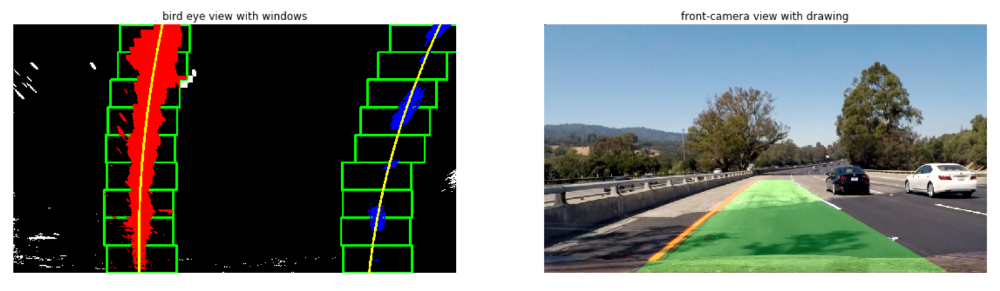

However, because after calculating the coefficient of quadratic function about left lane and right lane. We could simplify operations on searching. In the successor frames, we evaluate the (x,y) positions of pixels along the left and right lane and fit a polynomial and keep update the coefficient of quadratic function with new detected pixels.

> for implementation details check functions in `lanetracker/line.py`.


## Measure Curvature of Radius and Vehicle Position 

### Curvature of Radius

Because there are lots of pixels at the same x position of left lane boundary and right lane boundary, it would be better for us to evaluate (x, y) points of lane boundary along y axis. 

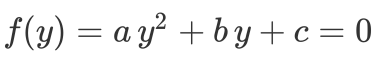

The radius of curvature ([awesome tutorial here](http://www.intmath.com/applications-differentiation/8-radius-curvature.php)) at any point x of the function x=f(y) is given as follows:

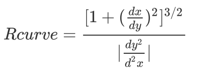

In the case of the second order polynomial above, the first and second derivatives are:  

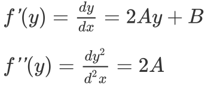

So, our equation for radius of curvature becomes: 

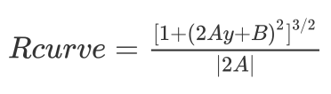

In my Python code, I use the `y` value at the bottom of the image. It is the closet position to our car.

```python
ploty = np.linspace(0, 719, 720)
y_eval = np.max(ploty)
```

Also because we need to calculate distance to camera in real world coordinate system (e.g. meters), we assume that there are 3.7 meters for 700 pixels for x axis, and 30 meters for 720 pixels for y axis.

```python
ym_per_pix = 30/720   # meters per pixel in y dimension
xm_per_pix = 3.7/700  # meters per pixel in x dimension
```

Now we can calculate curvature of radius according to our formulas,

```python
# leftx : the collection of x values of pixels belongs to left lane boundary
# rightx : the collection of x values of pixels belongs to right lane boundary

# Fit new polynomials to x, y in world space
left_fit_cr = np.polyfit(ploty*ym_per_pix, leftx*xm_per_pix, 2)
right_fit_cr = np.polyfit(ploty*ym_per_pix, rightx*xm_per_pix, 2)

left_curverad = ((1 + (2*left_fit_cr[0]*y_eval*ym_per_pix + left_fit_cr[1])**2)**1.5) \
				/ np.absolute(2*left_fit_cr[0])
right_curverad = ((1 + (2*left_fit_cr[0]*y_eval*ym_per_pix + right_fit_cr[1])**2)**1.5) \
                     / np.absolute(2*left_fit_cr[0])
    
# take the average value of left_curverad and right_curverad
return int(np.average([left_curverad, right_curverad]))
```

### Vehicle Position

We calculates the deviation of the midpoint of the lane `x_eval` from the center of the image `car position`

Again, we evaluate our x position of car to be at the bottom of image. Take the average value of x position at left lane and x position at right lane.

Also we assume that there are 3.7 meters for 700 pixels for x axis.

```python
y_eval = int(np.max(ploty))
x_eval = int(np.average([leftx[y_eval], rightx[y_eval]]))

xm_per_pix = 3.7 / 700

# Here, w // 2 is car position
# 		x_eval is middle position of lane
# if distance > 0, then it means car is at the right of center.
# if distance < 0, then it means car is at the left of center
distance = round((w // 2 - x_eval) * xm_per_pix, 3)
```

Here is the final result of our example,

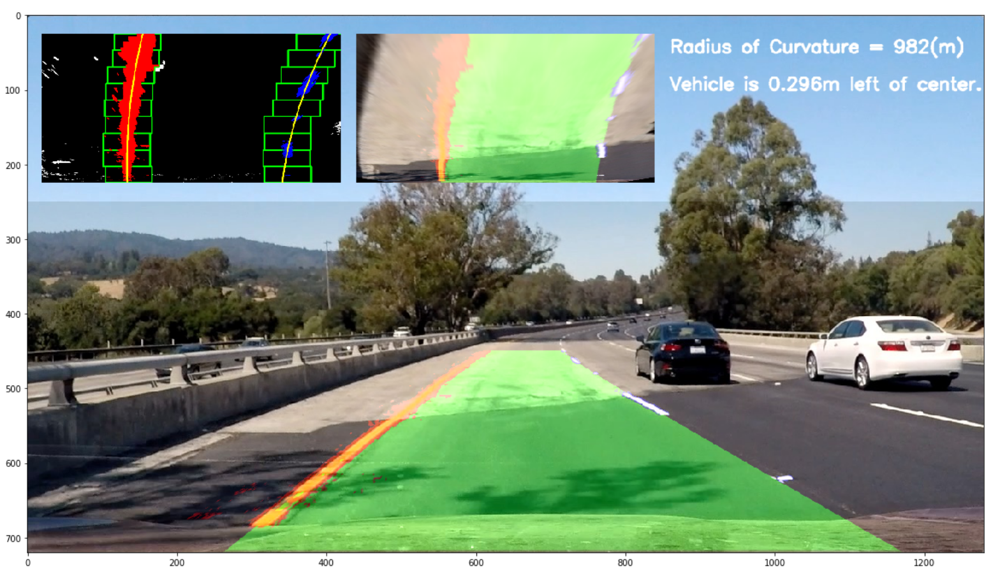

> for implementation details check functions in `lanetracker/line.py`.


# Vehicle Tracking

The software pipeline to detect the cars around in the given video which includes the following steps applying to each frame:

- **Extract the feature of training data.** 
- **Train cars/notcars data with LinearSVM**
- **Apply Sliding Window Search with the trained SVM classifier to detect the cars.**


## Extract the feature of training data

Roughly the information we need are **color** and **shape** of cars. We collected our feature vector from three sources. 

* Spatial Bining of the image with selected colorspace.  (**color and shape** information)
* Color Histogram of the image with selected colorspace.  (**color** information)
* HOG of the image with the selected colorspace. (**shape** information)

```python
Num of spatial_features in one 64x64 sampling image : 3072 (32*32*3)
Num of hist_features in one 64x64 sampling image    :   48 (16*3)
Num of hog_features in one 64x64 sampling image     : 5880
Num of Total features in one 64x64 sampling image   : 9000
```

**IMPORTANT: Through try and error,  we could found that the cars to be detected usually have better performance with YCrCb colorspace or YUV colorspace.**

### Spatial Bining

Spatial bining is a data pre-processing tech used to reduce the numbers of features of raw image without lossing the information of region of interest. Here I resize each sampling **64x64** image to **32x32**. By Testing, I found that resize to **16x16** would make the classfiier worse then **32x32**.

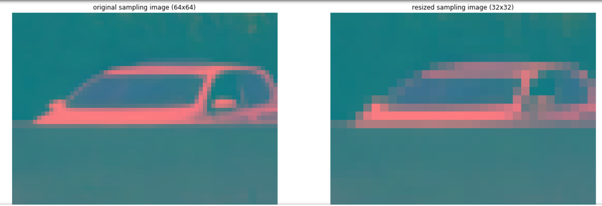


> vehicletracker/subset_of_project/color_spatial_binning.

### Color Histogram

For color information, It's a good idea to calculate the distribution of color histogram instead of just directly feeding raw image in. Cause it could make our classifier more robust to solve the variation of colors effected by view from different angle toward the same car. The following example image extracted from [ferrari home page](http://812superfast.ferrari.com/en/powertrain). (For demo, I use **RGB** instead of **YCrCb** used in project). In the project I split color histogram into **16** bins. By Testing, I found that there is no difference on the performance of detecting car between **32** and **16** bins. To reduce the numbers of feature, I choose **16**.

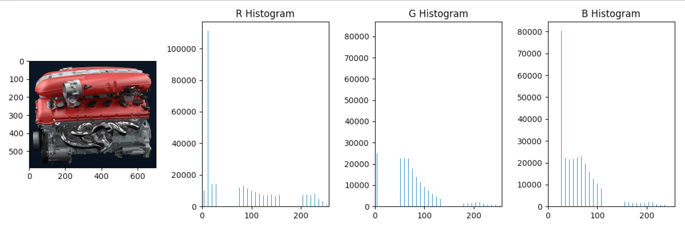

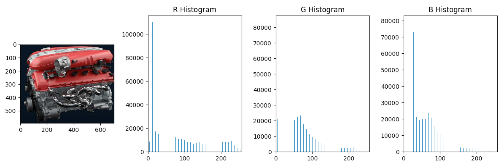

> for implementation details check functions in `vehicletracker/subset_of_project/color_histogram.py`.

### Histogram of Oriented Gradients (HOG)

The image below extracted from course of Udacity Self-driving Nanodegree. It shows that it is the gredient attribute that may be more rebust than color in classifying cars. However, even the gredient directly extracted from raw image will fail to detect cars due to the variation in view from different angle which dramatically change the shape of car.

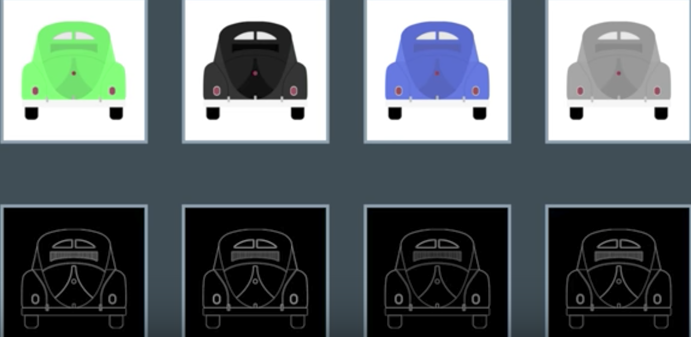

The essential thought behind the HOG descriptor is that local object appearance and shape within an image can be described well by the distribution of intensity gradients or orientations. (For more detail, see [wiki of HOG](https://en.wikipedia.org/wiki/Histogram_of_oriented_gradients)). It's normally to set orient number between 6 and 12. For this project, it is **10** makes perfect. I set one cell size equals to 8x8 pixels. Each pixel in one cell would get a vote on which histogram bin it belongs in based on the gradient direction at the position. And the weight of that vote depends on the gradient magnitude at that pixel. Furthermore, I set block size equals to 2x2 cells. We do the same operation on each block as on each cell instead that we also do block normalization which results in better invariance to changes in illumination and shadowing of the image.

If we set pix_per_cell too low (e.g. value 4, which is half of my setting), the time comsuption on computation would take 4 times of my setting. On the other hand, if we set pix_per_cell too high (e.g. value 16), the local range may too large to perfectly represent local object (features). Same as cell_per_block.

```python
block_norm  = 'L1-sqrt'  # block normalization function of HOG
color_space = 'YCrCb'    # It would be better to choose YUV or YCrCb
orient = 10  		     # HOG orientations
pix_per_cell = 8         # HOG pixels per cell
cell_per_block = 2       # HOG cells per block
hog_channel = 'ALL'      # Could be 0, 1, 2, or 'ALL'
```


It seem that if we use RGB colorspace, the HOG of R, G, B component may be reduntant to each other. However, in YCrCb, there are more different features to learn.

## Train cars/notcars data with LinearSVM

For training a classifier, I apply SVM operation with LinearSVC which is perferable for reducing the time of training. It is notable that it would be better to first normalization data with StandardScaler() provided in scikit learn library.

```python
# X = np.vstack((car_features, notcar_features)).astype(np.float64)                        
X = np.concatenate((car_features, notcar_features)).astype(np.float64)

# Fit a per-column scaler
X_scaler = StandardScaler().fit(X)
# Apply the scaler to X
scaled_X = X_scaler.transform(X)

# Define the labels vector
y = np.concatenate((np.ones(len(car_features)), np.zeros(len(notcar_features))))
```


## Apply Sliding Window Search

In order to find the car from the whole image recorded by camera, we should define the window to slide over it with given window size, step size and overlap rate. I split out the region of interest (y_range from **image.shape[0]//2** to **image.shape[0]**). To calculate HOG just once, I first calculate the HOG of each channel from whole image. Then I define some parameters as following:

```python
window = 64  # window size 64x64

# number of blocks per window
# given pix_per_cell=8, cell_per_block=2, we get nblocks_per_window = 7.
nblocks_per_window = (window // pix_per_cell) - cell_per_block + 1

# Instead of overlap, we define how may cells to step.
cells_per_step = 2 

# calculate how many blocks in the image along x axis and y axis.
nxblocks = (image.shape[1] // pix_per_cell) - cell_per_block + 1
nyblocks = (image.shape[0] // pix_per_cell) - cell_per_block + 1

# calculate the total steps (numbers of windows) along x axis and y axis. 
nxsteps = (nxblocks - nblocks_per_window) // cells_per_step + 1
nysteps = (nyblocks - nblocks_per_window) // cells_per_step + 1
```

With nxsteps and nxsteps, we could sub-sampling the HOG value, spatial bining and color histogram as features from each window.

However, it appears that there would be false position drawn with black rectangle, or multi-rectangle draw onto one object.

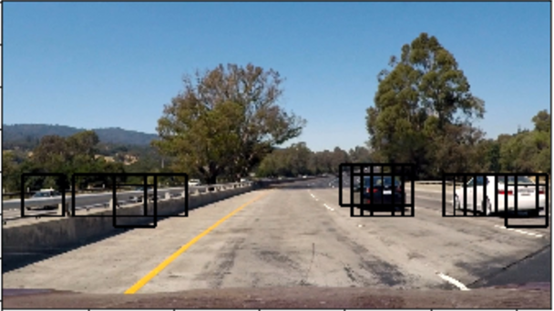

With the heap map as the threshing function, we could filter out the range with just one rectangle (may be the false position).

With the label function provided from scipy library, we could label out nearly one rectange per object.

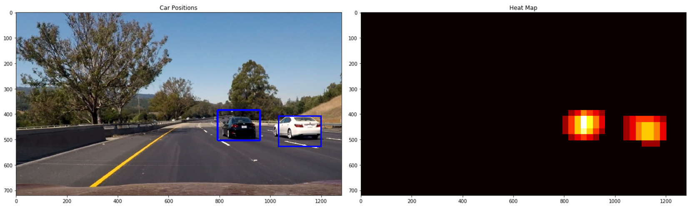

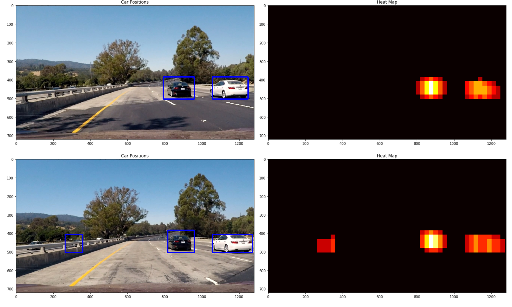

## Pipeline (video)


### Discussion

#### Briefly discuss any problems / issues you faced in your implementation of this project.  Where will your pipeline likely fail?  What could you do to make it more robust? 


#### Lane Tracking

As we mention before, I think the biggest problem of this repo is its ability to apply in reality data records by ourself without chaning too much.

Here I think two keys to handle this problem as following:

* **the selection of threshing combination from both color and gredient**

It's really difficult to pick the good range of threshing to apply in any situdation with different light and shadow. What I do is just take as many as source that is robust to light and shadows and pick the union of them to get as many as pixels from lane in case of detecting nothing.

* **Decide the range of src vertices in Perspective Tranformation Step**

Thx to [navoshta's repo](https://github.com/navoshta/detecting-road-features), it really gives me the way to tackle this problem. Instead of trying to pick exactly to edge to the lane from the given image, what we should do is to get the src vertices that will cover most of the lane in image in reality world.


#### Vehicle Detecting

We coud notice that sometimes the car may not be properly included in rectangle. e.g.

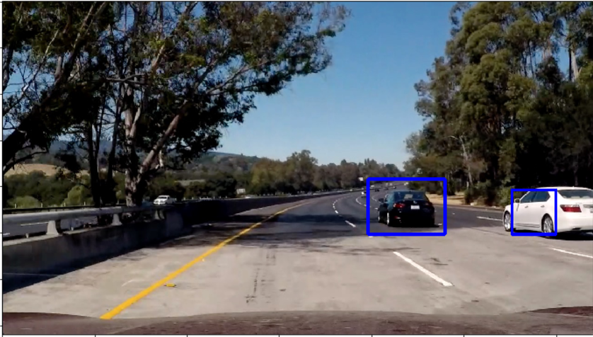

I think it could be improved if I found the better way to realize multi-scale window search with small rectangle closing to half of y-axis of image and large rectangle closing to the bottom of image.

# Important Note.

**This repo refer to [navoshta's repo](https://github.com/navoshta/detecting-road-features) with following content:**

* my README.md style
* my comment style in each module
* the modulization method (learning from **[camera.py](https://github.com/navoshta/detecting-road-features/blob/master/source/lanetracker/camera.py)**)


* the naming of flatten_perspective in **[perspective.py](https://github.com/navoshta/detecting-road-features/blob/master/source/lanetracker/perspective.py)**
* the way to decide dst and src vertices in **perspective.py**

Cause I'm almost the Newbie how to modulize, how to make a good comment, and how to write a good README.md. I feel appreciate with [navoshta's repo](https://github.com/navoshta/detecting-road-features).

About this Project
---

The images for camera calibration are stored in the folder called `camera_cal`.  The images in `test_images` are for testing your pipeline on single frames.  If you want to extract more test images from the videos, you can simply use an image writing method like `cv2.imwrite()`, i.e., you can read the video in frame by frame as usual, and for frames you want to save for later you can write to an image file.  

To help the reviewer examine your work, please save examples of the output from each stage of your pipeline in the folder called `ouput_images`, and include a description in your writeup for the project of what each image shows.    The video called `project_video.mp4` is the video your pipeline should work well on.  

The `challenge_video.mp4` video is an extra (and optional) challenge for you if you want to test your pipeline under somewhat trickier conditions.  The `harder_challenge.mp4` video is another optional challenge and is brutal!

If you're feeling ambitious (again, totally optional though), don't stop there!  We encourage you to go out and take video of your own, calibrate your camera and show us how you would implement this project from scratch!
